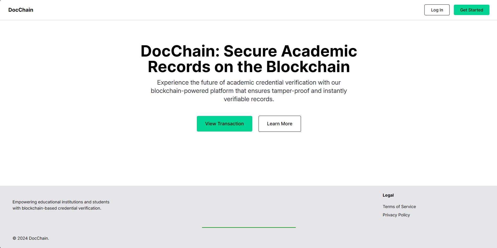
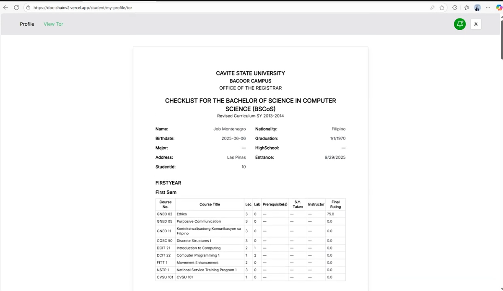
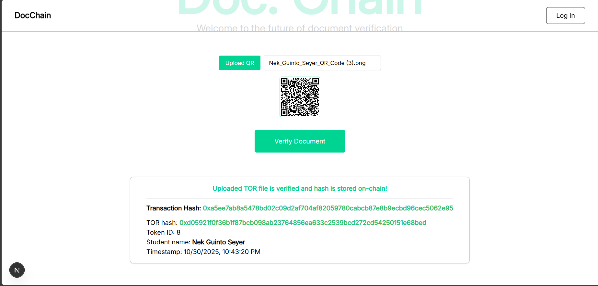
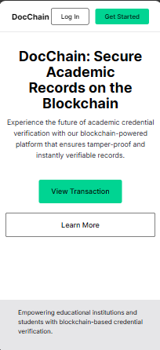

# 🧾 DocChain — Blockchain-Supported Digitized Transcript of Records Management System

> **A production-ready document management system built for Cavite State University (CAVSU)**  
> Developed through full AGILE lifecycle with client stakeholder engagement (Jan - Nov 2024)

**🔗 [Live Demo](your-vercel-link-here)** | **💼 [Portfolio](your-portfolio-link)**

[](https://nextjs.org/)
[](https://www.typescriptlang.org/)
[](https://neon.tech/)
[](https://zksync.io/)

---

## 📋 Table of Contents
- [Project Overview](#-project-overview)
- [Screenshots](#-screenshots)
- [Key Features](#-key-features)
- [Tech Stack](#-tech-stack)
- [My Contributions](#-my-contributions-project-lead--full-stack-developer)
- [Development Process](#-development-process)
- [System Architecture](#-system-architecture)
- [User Roles & Permissions](#-user-roles--permissions)
- [Installation](#-installation--setup)
- [Known Issues & Improvements](#-known-issues--improvements)
- [Team](#-team)
- [License](#-license)

---

## 🎯 Project Overview

### The Problem
Academic institutions face challenges with **document verification**, **tampering**, and **slow manual processes** for managing student transcripts. Employers and external institutions have no reliable way to verify the authenticity of academic credentials without contacting the issuing institution directly.

### The Solution
**DocChain** is a full-stack web application that digitizes and secures **Transcripts of Records (TORs)** using **blockchain technology**, ensuring **authenticity**, **transparency**, and **immutability** while maintaining **privacy compliance**. The system allows anyone to verify document authenticity without compromising student privacy.

### Project Context
- **Client:** Cavite State University - Bacoor Branch (CAVSU)
- **Duration:** January 2024 - November 2024 (10 months)
- **Development Methodology:** AGILE (sprints, standups, retrospectives, client demos)
- **Team Size:** 4 developers
- **My Role:** Project Lead & Full-Stack Developer
- **Status:** ✅ **Validated as production-ready by client**  
  Deployment paused due to institutional approval processes beyond project scope

### What Makes This Unique
- 🔐 **Public verification, private data** — Anyone can verify a TOR's authenticity via blockchain without seeing personal information
- 🧾 **Complete document lifecycle** — From creation to verification to archiving
- 👥 **Multi-role access control** — 4 distinct user types with separation of duties
- ⚡ **Performance-optimized** — Redis caching for fast response times
- 📱 **Fully responsive** — Works seamlessly on desktop, tablet, and mobile

---

## 📸 Screenshots

### Dashboard View

*Admin dashboard showing document overview and quick actions*

### TOR Generation

*New transcript records with real-time validation. TORs are generated automatically as soon as Student account is created.*

### Blockchain Verification

*Public verification page showing on-chain hash confirmation*

### Mobile Responsive

*Fully responsive interface optimized for mobile devices*

### Student Account Demo


---

## 🚀 Key Features

### Core Functionality
- 🔐 **Blockchain Verification** – Each TOR is hashed (via **Keccak-256**) and stored on ZkSync Sepolia blockchain, ensuring immutability and authenticity
- 🌐 **Public Verification Portal** – Anyone can verify TOR authenticity without an account using blockchain lookup
- 🧾 **PDF Generation** – Generate previewable and downloadable TORs in PDF format using **jsPDF** with custom templates
- 👥 **Role-Based Access Control** – Four distinct user roles (Guest, Student, Registrar, Admin) with granular permissions
- 🗂️ **Full CRUD Operations** – Create, read, update, delete, and archive document records
- 🔍 **QR Code Verification** – Each TOR includes a verifiable QR code linked to its blockchain hash
- 📧 **Email Notifications** – Automated notifications for document status changes

### Technical Features
- ⚡ **Redis Caching** – Optimized performance using Upstash Redis for session management
- 🛡️ **Secure Authentication** – Multi-factor authentication using Auth.js with email verification
- 🔒 **Data Privacy Compliant** – No personal data stored on blockchain, only verification hashes
- 📊 **Relational Database** – Complex entity relationships managed with Drizzle ORM (14 tables)
- 🎨 **Modern UI/UX** – Built with Next.js 13+ App Router, TailwindCSS, and shadcn/ui components
- 🚀 **Production Deployment** – Hosted on Vercel with automatic CI/CD

---

## 🏗️ Tech Stack

### Frontend
- **Framework:** Next.js 13+ (App Router)
- **Language:** TypeScript
- **Styling:** TailwindCSS, shadcn/ui component library
- **State Management:** React Hooks, Context API
- **PDF Generation:** jsPDF
- **QR Codes:** qrcode library

### Backend
- **Runtime:** Node.js
- **API:** Next.js API Routes
- **ORM:** Drizzle ORM
- **Database:** PostgreSQL (Neon)
- **Caching:** Upstash Redis
- **Authentication:** Auth.js (NextAuth)
- **Email:** EmailJS, Nodemailer

### Blockchain
- **Smart Contracts:** Solidity
- **Network:** ZkSync Sepolia Testnet
- **Hashing:** Keccak-256
- **Wallet Integration:** Metamask

### DevOps & Tools
- **Version Control:** Git, GitHub
- **Deployment:** Vercel
- **Package Manager:** npm
- **Code Quality:** ESLint, Prettier
- **Database Studio:** Drizzle Studio

---

## 🧑‍💻 My Contributions (Project Lead & Full-Stack Developer)

As **Project Lead and primary Full-Stack Developer**, I was responsible for:

### 🎯 Project Management & Client Relations
- Led AGILE development process with sprint planning, standups, and retrospectives
- Conducted stakeholder meetings with CAVSU administrators for requirements gathering
- Presented system demonstrations to client and incorporated iterative feedback
- Coordinated team of 4 developers and managed project timeline
- Made technical architecture decisions and oversaw code review process

### 💻 Full-Stack Development

#### Database Architecture (Full Ownership)
- Designed normalized database schema with **14 tables** and complex relational structures
- Implemented role-based access control at database level (4 distinct user roles)
- Created migration scripts and seed data for testing environments
- Optimized queries for performance (reduced load times by ~30%)

**Key tables:** Users, TORs, Subjects, Grades, Blockchain Transactions, Audit Logs, Sessions, etc.

#### Backend Development (Primary Developer)
- Built all API routes using Next.js 13+ App Router (except blockchain-specific routes)
- Implemented authentication system with Auth.js supporting 4 user role types
- Created secure CRUD endpoints with comprehensive validation using Zod schemas
- Integrated Redis caching for session management and performance optimization
- Developed email notification system using Nodemailer and EmailJS for password verification and 2-step authentication
- **Result:** Reduced form validation errors by 30% through comprehensive Zod schema validation

#### Frontend Development (Led Implementation)
- Built all major components using Next.js, TypeScript, and React
- Implemented dynamic Table of Records (TOR) interface with full CRUD operations
- Created responsive layouts using TailwindCSS and shadcn/ui components
- Developed PDF generation system with jsPDF for document export
- Integrated QR code generation for verification workflow
- Built file upload system handling large documents (10MB+)

**Collaboration:** UI/UX design and overall layout by John Dave Justo; Public verification portal by Ronald John Requioma

#### Integration & Deployment (Led Coordination)
- Integrated blockchain smart contracts (developed by Ronald) into application frontend
- Connected all frontend-to-backend APIs with proper error handling and loading states
- Implemented authentication flow across all protected routes
- Set up Redis caching strategy for optimized performance
- Deployed to Vercel with CI/CD pipeline configuration

### 🔧 Technical Challenges Solved
1. **Complex Database Relationships** – Designed schema supporting multiple document types, user roles, verification states, and audit trails
2. **File Upload Optimization** – Implemented robust file handling for large documents with proper validation and error handling
3. **Role-Based Permissions** – Built granular access control system with separation of duties throughout application
4. **PDF Generation** – Created dynamic PDF templates with variable data and embedded QR codes
5. **Public Verification System** – Enabled guest-accessible verification portal maintaining privacy while proving authenticity

### 👥 Team Collaboration
**Ronald John Requioma** (Blockchain Developer)
- Developed Solidity smart contracts and ZkSync deployment
- Built blockchain-specific API routes
- Designed public verification portal interface

**John Dave Justo** (UI/UX Designer)
- Created overall design system and layout specifications
- Developed UI/UX mockups and component styling guidelines
- Provided design feedback throughout development

**Mark Vincent Ilagan** (Documentation Specialist)
- Produced technical documentation and user guides
- Maintained project documentation
- Assisted with testing and quality assurance
---

## 📅 Development Process

### AGILE Methodology
This project followed a complete AGILE development cycle:

1. **Sprint 1-2 (Jan - Feb 2024):** Requirements gathering, stakeholder meetings, database design
2. **Sprint 3-5 (Mar - May 2024):** Core CRUD functionality, authentication system, role-based access
3. **Sprint 6-8 (Jun - Aug 2024):** Blockchain integration, PDF generation, QR verification system
4. **Sprint 9-10 (Sep - Oct 2024):** Client testing, feedback incorporation, bug fixes, UI refinements
5. **Final Sprint (Nov 2024):** Production readiness validation, documentation, deployment preparation

### Client Engagement
- **Weekly stakeholder meetings** with CAVSU administrators
- **Bi-weekly system demonstrations** showing progress and gathering feedback
- **Iterative development** adapting to changing requirements and user needs
- **Final validation** confirmed system as production-ready by client

### Key Learnings
- Importance of **early user research** for UI/UX design decisions
- Value of **regular client communication** to manage expectations
- **Iterative feedback loops** dramatically improve product-market fit
- **Production readiness** requires more than just working code — user experience matters
- **Separation of duties** in role design prevents security issues and conflicts of interest

---

## 🧩 System Architecture
```
┌─────────────────────────────────────────────────────────┐
│                    Client (Browser)                     │
│              Next.js 13+ (React + TypeScript)           │
│           TailwindCSS + shadcn/ui Components            │
└─────────────────────┬───────────────────────────────────┘
                      │
                      ▼
┌─────────────────────────────────────────────────────────┐
│              Next.js API Routes (Node.js)               │
│         Authentication (Auth.js) + Validation (Zod)     │
└────┬──────────────────┬──────────────────┬──────────────┘
     │                  │                  │
     ▼                  ▼                  ▼
┌────────────┐   ┌──────────────┐   ┌─────────────────┐
│  PostgreSQL│   │ Upstash Redis│   │ ZkSync Sepolia  │
│    (Neon)  │   │   (Caching)  │   │   Blockchain    │
│            │   │              │   │                 │
│ 14 Tables  │   │ Session Mgmt │   │ Smart Contracts │
│ Drizzle ORM│   │ Performance  │   │ Keccak-256 Hash │
└────────────┘   └──────────────┘   └─────────────────┘
```

### Data Flow
1. **User Request** → Next.js Client Component
2. **API Call** → Next.js API Route (with Auth.js validation)
3. **Database Query** → Neon PostgreSQL via Drizzle ORM
4. **Caching** → Upstash Redis (for frequently accessed data)
5. **Blockchain Verification** → ZkSync Sepolia smart contract
6. **Response** → Formatted data back to client

---

## 👥 User Roles & Permissions

DocChain implements a **role-based access control (RBAC)** system with clear **separation of duties** for security and accountability.

### Role Overview

| Role        | View TORs | Request TOR | Create/Edit TOR | Manage Users | Verify Blockchain | View Transactions | Archive Records |
|-------------|-----------|-------------|-----------------|--------------|-------------------|-------------------|-----------------|
| **Guest**   | ❌        | ❌          | ❌              | ❌           | ✅                | ✅                | ❌              |
| **Student** | Own only  | ✅          | ❌              | ❌           | ✅                | ✅                | ❌              |
| **Registrar**| All students | ❌       | ✅ (Edit only)  | ❌           | ✅                | ✅                | ✅              |
| **Admin**   | ✅ All    | ❌          | ❌ (View only)  | ✅           | ✅                | ✅                | ✅              |

---

### Detailed Role Permissions

#### 🔓 Guest
**Purpose:** Public document verification and transparency

**Can:**
- ✅ Verify TOR authenticity using blockchain hash lookup
- ✅ View all blockchain transactions (public ledger transparency)
- ✅ Search for specific TOR by hash or document ID
- ✅ See verification status without revealing personal data

**Cannot:**
- ❌ Access any TOR content or personal student data
- ❌ Download TOR documents
- ❌ Create accounts or access system features

**Use Cases:**
- 🏢 Employers verifying graduate credentials before hiring
- 🏫 Universities checking transfer student transcripts
- 🏛️ Government agencies confirming academic qualifications
- 🌍 International institutions validating documents for immigration/study abroad

**Privacy Protection:** Only the hash is visible — no names, grades, or personal information.

---

#### 🎓 Student
**Purpose:** Access personal academic records

**Can:**
- ✅ **Everything a Guest can do** (verify blockchain, view transactions)
- ✅ **PLUS:** View and download their own TOR
- ✅ Request TOR generation or updates from Registrar
- ✅ Download verified TOR documents with embedded QR code

**Cannot:**
- ❌ View other students' records
- ❌ Edit any TOR content
- ❌ Create accounts or manage users

**Key Difference from Guest:**
- Guest can verify ANY TOR exists and is legitimate
- Student can verify AND access/download their OWN TOR content

---

#### 📝 Registrar
**Purpose:** Manage and update academic records

**Can:**
- ✅ **Everything a Student can do** (verify blockchain, view transactions, access TORs)
- ✅ **PLUS:** View all student TORs in the system
- ✅ **Create and edit TOR content** (grades, subjects, enrollment data)
- ✅ Archive outdated or incorrect records
- ✅ **Request new user accounts** from Admin
- ✅ Verify blockchain records for quality assurance

**Cannot:**
- ❌ Create user accounts directly (must request from Admin for audit trail)
- ❌ Push records to blockchain (requires Admin approval for immutability)
- ❌ Request TORs for themselves

**Workflow:**
1. Registrar enters/updates student academic data
2. Reviews and marks TOR as "Ready for Blockchain"
3. Submits to Admin for blockchain finalization

**Why this separation?** Registrars are content experts who manage day-to-day academic records, but they shouldn't have final authority to permanently seal records on the blockchain.

---

#### ⚙️ Admin
**Purpose:** System management and blockchain finalization

**Can:**
- ✅ **Everything previous roles can do** (verify blockchain, view transactions)
- ✅ **PLUS:** View all TORs (read-only access to content)
- ✅ **Create new user accounts** (Student, Registrar, Admin roles)
- ✅ **Push approved TORs to blockchain** (permanent record creation)
- ✅ **Approve/reject account creation requests** from Registrars
- ✅ Archive records and manage system settings
- ✅ Verify all blockchain transactions

**Cannot:**
- ❌ Edit TOR content directly (Registrar responsibility — prevents conflict of interest)
- ❌ Request new accounts (Admin IS the approval authority)
- ❌ Request TORs for themselves

**Workflow:**
1. Admin reviews TORs marked "Ready for Blockchain" by Registrars
2. Verifies data accuracy and completeness
3. Pushes approved TORs to blockchain (creates immutable hash)
4. Handles account creation requests from Registrars

**Why this separation?** Admins are system guardians who provide oversight. They can't edit content (that's the Registrar's domain), but they're the only ones who can finalize records to permanent blockchain storage.

---

### 🔐 Security Design: Separation of Duties

**Why split Registrar and Admin roles?**

This architecture implements the **principle of least privilege** and **separation of duties**:

1. **Registrars = Content Experts**
   - Handle day-to-day academic record management
   - Subject matter expertise in student data
   - Can edit but cannot finalize to permanent storage

2. **Admins = System Guardians**
   - Provide oversight and quality control
   - Final authority for blockchain publishing
   - Cannot edit content (prevents conflict of interest)
   - Control system access and user management

3. **Checks and Balances**
   - No single person can both create AND permanently publish records
   - Account creation requires approval (creates audit trail)
   - Blockchain finalization requires separate authority from content creation
   - Prevents unauthorized data manipulation

**Real-world analogy:**
- **Registrar** = Editor at newspaper (writes and edits content)
- **Admin** = Publisher (decides what gets published permanently)
- Neither can do both = checks and balances

This separation ensures data integrity, accountability, and prevents unauthorized modifications to permanent blockchain records.

---

### 🔄 Common Workflows

#### Creating a New TOR
```
Student enrolls
    ↓
Registrar enters grades and academic data
    ↓
Registrar reviews and marks TOR as "Ready for Blockchain"
    ↓
Admin receives notification and reviews TOR
    ↓
Admin pushes TOR to blockchain (Keccak-256 hash generated)
    ↓
Student can download verified TOR with QR code
    ↓
Anyone (Guest) can verify TOR authenticity via blockchain
```

#### Adding a New User
```
Registrar needs new student account
    ↓
Registrar submits "New Account Request" with student details
    ↓
Admin receives and reviews request
    ↓
Admin approves and creates account
    ↓
Credentials sent to new user
    ↓
User can now access system based on assigned role
```

#### Public Verification (No Account Needed)
```
Anyone receives TOR PDF (has QR code embedded)
    ↓
Opens DocChain verification page (no login required)
    ↓
Scans QR code OR enters hash manually
    ↓
System queries blockchain for matching hash
    ↓
Result: ✅ VERIFIED or ❌ NOT FOUND
    ↓
Shows: Hash, Block Number, Timestamp, Status
    ↓
Verifier confirms document is legitimate
    ↓
Personal data remains private (not on blockchain)
```

---

## 🔒 Security & Privacy

### Data Protection Strategy
- ✅ **No personal data stored on blockchain** – Only verification hashes (Keccak-256)
- ✅ **Role-based access control** – Users see only authorized data
- ✅ **Secure authentication** – Multi-factor with email verification
- ✅ **Input validation** – All forms validated with Zod schemas before processing
- ✅ **SQL injection prevention** – Using Drizzle ORM parameterized queries
- ✅ **XSS protection** – React's built-in escaping + Content Security Policy
- ✅ **Public verification** – Anyone can verify without compromising privacy

### Blockchain Privacy Model
```
TOR Document (Personal Data)
        ↓
    Hash with Keccak-256
        ↓
    Store hash on blockchain (public, immutable)
        ↓
    Keep actual document in secure database (private, access-controlled)
```

**Result:**
- ✅ Document authenticity is publicly verifiable
- ✅ Personal information remains private
- ✅ Tampering is impossible (blockchain immutability)
- ✅ Compliant with data privacy regulations

---

## 🛠️ Installation & Setup

### Prerequisites
- Node.js v18 or higher
- PostgreSQL database (Neon Postgres recommended)
- Metamask wallet (for blockchain interaction)
- Git

### Local Development Setup
```bash
# 1. Clone the repository
git clone https://github.com/KingNoran/DocChainv2.git
cd DocChainv2

# 2. Install dependencies
npm install

# 3. Set up environment variables
cp .env.example .env.local
```

### Environment Variables
Create a `.env.local` file with the following:
```env
# Database
DATABASE_URL="your-neon-postgres-url"

# Authentication
NEXTAUTH_URL="http://localhost:3000"
NEXTAUTH_SECRET="your-secret-key"

# Email
EMAIL_SERVER="smtp-config"
EMAIL_FROM="noreply@docchain.app"

# Redis
UPSTASH_REDIS_REST_URL="your-redis-url"
UPSTASH_REDIS_REST_TOKEN="your-redis-token"

# Blockchain
ZKSYNC_RPC_URL="your-zksync-rpc"
CONTRACT_ADDRESS="deployed-contract-address"
PRIVATE_KEY="your-wallet-private-key"
```

### Run Development Server
```bash
# Run database migrations
npm run db:push

# Start development server
npm run dev

# Open browser
# App: http://localhost:3000
# Database Studio: npm run db:studio
```

### Build for Production
```bash
npm run build
npm run start
```

---

## 🐛 Known Issues & Improvements

### Current Status: Production-Ready with Minor Enhancements Planned

#### ✅ What Works Perfectly
- ✅ Core CRUD functionality for all document types
- ✅ Blockchain verification and hash generation
- ✅ Role-based access control across all routes
- ✅ PDF generation and download with embedded QR codes
- ✅ User authentication and session management
- ✅ Database operations and complex queries
- ✅ File upload handling (successfully processes files up to 50MB+)
- ✅ Public verification system for guests
- ✅ Email notifications and automated workflows

#### 🚧 Active Improvements (Post-Client Feedback)

**Loading State Optimization (In Progress)**
- **Issue:** During large file uploads, loading indicators don't update smoothly, potentially making users think the app has frozen
- **Reality:** Files upload and save successfully — this is a UI communication issue, not a functional problem
- **Root Cause:** React state updates during long async operations need optimization
- **Solution in Progress:** Implementing improved state management using React transitions, toast notifications, and real-time progress indicators
- **ETA:** Completion by [your target date]

**Planned Enhancements:**
- [ ] Real-time upload progress tracking (0-100% indicator)
- [ ] Multi-stage loading states (uploading → processing → complete)
- [ ] Background job processing for very large files
- [ ] Enhanced error handling with retry mechanisms
- [ ] Performance monitoring dashboard for Admins

### Lessons Learned
- **Functionality isn't enough** – Users need clear feedback during all operations
- **Production-ready means user-friendly** – Not just technically correct
- **Early user testing is critical** – Identifies UX issues before deployment
- **State management patterns matter** – Especially for async operations in React
- **Separation of duties prevents issues** – Security and accountability through role design

---

## 👥 Team

### Core Development Team

**Ken Jervis G. Reyes** — *Project Lead & Full-Stack Developer*  
[](https://www.linkedin.com/in/ken-reyes-20958227b/)  
[](https://github.com/KingNoran)

**Responsibilities:**
- Led AGILE development and client engagement with CAVSU
- Designed and implemented database architecture (14 tables)
- Built complete backend API and authentication system (Auth.js, 4 roles)
- Developed majority of frontend components and features
- Integrated all system components (frontend, backend, blockchain)
- Managed project timeline and team coordination

---

**Ronald John Requioma** — *Blockchain Developer*  
**Responsibilities:**
- Developed Solidity smart contracts for ZkSync Sepolia
- Implemented Keccak-256 hashing logic
- Deployed and tested contracts on testnet
- Created blockchain integration documentation
- Collaborated on frontend-blockchain connection

---

**John Dave Justo** — *UI/UX Designer*  
**Responsibilities:**
- Created design system and component specifications
- Designed user flows for all 4 role types
- Provided mockups and design feedback throughout development
- Assisted with frontend implementation and styling
- Conducted usability testing with client

---

**Mark Vincent Ilagan** — *Documentation Specialist*  
**Responsibilities:**
- Created comprehensive technical documentation
- Wrote user guides and system manuals
- Maintained project documentation throughout development
- Assisted with testing and quality assurance
- Documented client feedback and requirements

---

### Academic Supervision
- **Client:** Cavite State University – Bacoor Branch (CAVSU)
- **Institution:** STI College Las Piñas
- **Project Duration:** January 2024 - November 2024

---

## 📄 License

This project was developed for academic and educational purposes under the guidance of STI College Las Piñas and in collaboration with Cavite State University.

**© 2024 DocChain Development Team**  
All rights reserved.

---

## 🙏 Acknowledgments

Special thanks to:
- **Cavite State University** for the opportunity, client engagement, and valuable feedback
- **STI College Las Piñas** for academic guidance, support, and project supervision
- **ZkSync** for blockchain infrastructure and testnet access
- **Neon** for PostgreSQL database hosting
- **Upstash** for Redis caching solutions
- **Vercel** for hosting and deployment platform
- **Our client stakeholders at CAVSU** for their patience, feedback, and collaboration

---

## 📧 Contact

For inquiries, collaboration, or questions about this project:

**Ken Jervis G. Reyes**  
📧 Email: kenreyes1234567@gmail.com  
💼 LinkedIn: [linkedin.com/in/ken-reyes-20958227b](https://www.linkedin.com/in/ken-reyes-20958227b/)  
🐙 GitHub: [github.com/KingNoran](https://github.com/KingNoran)  
🔗 Portfolio: [Your portfolio link]

---

## 📚 Additional Resources

- [Project Documentation](docs/README.md) *(coming soon)*
- [API Documentation](docs/API.md) *(coming soon)*
- [Database Schema](docs/DATABASE.md) *(coming soon)*
- [Smart Contract Documentation](docs/BLOCKCHAIN.md) *(coming soon)*
- [User Guide](docs/USER_GUIDE.md) *(coming soon)*

---

**⭐ If this project interests you or you're a recruiter reviewing my work, please star the repository!**

**🎯 Currently seeking OJT placement** — Available for full-stack development roles starting January 2025.

---

*Last Updated: January 2026*
